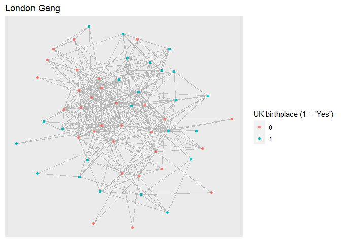

Network Analysis in R (NSCR-R Workshop)
================

### Libraries

``` r
library(tidyverse)
library(tidygraph)
library(igraph)
library(ggraph)
library(statnet)
```

# 1. The Basics: Network Construction and Network Visualization

**London gang network data from: **
<http://www.socialsciences.manchester.ac.uk/mitchell-centre/research/covert-networks>
(via <https://github.com/schochastics/networkdata>)

### 1.1 One-mode network from an adjacency matrix

``` r
# Read a matrix in which cells indicate who is connected to whom: 
m <- read.csv("https://raw.githubusercontent.com/Ieke/NSCR_network_workshop/main/matrix_example.csv", header=TRUE, row.names=1, check.names = F) %>%   
  as.matrix()
dim(m) 
```

    ## [1] 54 54

``` r
# Create a network object using igraph 
gang.network1 <- graph_from_adjacency_matrix(m, mode=c("undirected"), weighted=NULL)
# Inspect the network
gang.network1
```

    ## IGRAPH 45b627a UN-- 54 315 -- 
    ## + attr: name (v/c)
    ## + edges from 45b627a (vertex names):
    ##   [1] 1--2  1--3  1--4  1--5  1--6  1--7  1--8  1--9  1--10 1--11 1--12 1--17
    ##  [13] 1--18 1--20 1--21 1--22 1--23 1--25 1--27 1--28 1--29 1--43 1--45 1--46
    ##  [25] 1--51 2--3  2--6  2--7  2--8  2--9  2--10 2--11 2--12 2--13 2--14 2--16
    ##  [37] 2--18 2--21 2--22 2--23 2--25 2--28 2--29 2--30 2--31 2--38 3--4  3--5 
    ##  [49] 3--6  3--7  3--8  3--9  3--10 3--12 3--13 3--14 3--15 3--18 3--21 3--22
    ##  [61] 3--29 3--33 3--34 3--35 3--36 3--54 4--5  4--6  4--7  4--12 4--13 4--14
    ##  [73] 4--15 4--17 4--18 4--19 4--20 4--23 4--25 4--28 4--35 4--36 4--41 4--44
    ##  [85] 4--49 5--6  5--7  5--9  5--10 5--12 5--13 5--14 5--15 5--17 5--18 5--19
    ## + ... omitted several edges

### 1.2 One-mode network from an edgelist and attribute data

``` r
# Read the edgelist in which each row represents an edge from one node to another node 
e <- read.csv("https://raw.githubusercontent.com/Ieke/NSCR_network_workshop/main/edges_example.csv", header=TRUE) 
head(e)
```

    ##   personA personB
    ## 1       1       2
    ## 2       1       3
    ## 3       1       4
    ## 4       1       5
    ## 5       1       6
    ## 6       1       7

``` r
# Edgelists exclude the isolates  
# Bring in the attribute data for all nodes (including the isolates )
a <- read.csv("https://raw.githubusercontent.com/Ieke/NSCR_network_workshop/main/attributes_example.csv", header=TRUE)
head(a)
```

    ##   X index Age Arrests Convictions Prison Birthplace
    ## 1 1     1  20      16           4      1          1
    ## 2 2     2  20      16           7      1          2
    ## 3 3     3  19      12           4      1          2
    ## 4 4     4  21       8           1      0          2
    ## 5 5     5  24      11           3      0          2
    ## 6 6     6  25      17          10      0          3

``` r
# Create a network object using igraph 
gang.network2 <- graph_from_data_frame(e, directed=FALSE, vertices=a)
gang.network2
```

    ## IGRAPH 4631631 UN-- 54 315 -- 
    ## + attr: name (v/c), index (v/n), Age (v/n), Arrests (v/n), Convictions
    ## | (v/n), Prison (v/n), Birthplace (v/n)
    ## + edges from 4631631 (vertex names):
    ##  [1] 1--2  1--3  1--4  1--5  1--6  1--7  1--8  1--9  1--10 1--11 1--12 1--17
    ## [13] 1--18 1--20 1--21 1--22 1--23 1--25 1--27 1--28 1--29 1--43 1--45 1--46
    ## [25] 1--51 2--3  2--6  2--7  2--8  2--9  2--10 2--11 2--12 2--13 2--14 2--16
    ## [37] 2--18 2--21 2--22 2--23 2--25 2--28 2--29 2--30 2--31 2--38 3--4  3--5 
    ## [49] 3--6  3--7  3--8  3--9  3--10 3--12 3--13 3--14 3--15 3--18 3--21 3--22
    ## [61] 3--29 3--33 3--34 3--35 3--36 3--54 4--5  4--6  4--7  4--12 4--13 4--14
    ## [73] 4--15 4--17 4--18 4--19 4--20 4--23 4--25 4--28 4--35 4--36 4--41 4--44
    ## + ... omitted several edges

``` r
# Plot the networks side by side (worry about prettier visualizations later)
# Default layout: layout_nicely (chooses best layout). 
# Connected graphs with less than 1000 vertices: default = Fruchterman-Reingold layout  
# https://schneide.blog/tag/fruchterman-reingold/
par(mfrow=(c(1,2)))
plot(gang.network1)
plot(gang.network2)
```

<!-- -->

### 1.3 Two-mode and one-mode networks from event data

``` r
# Read event data  
event <- read.csv("https://raw.githubusercontent.com/Ieke/NSCR_network_workshop/main/event_example.csv", header=T)
unique(event$event) 
```

    ## [1] "A" "B" "C" "D" "E"

``` r
unique(event$person)
```

    ##  [1]  1  2  3  4  5  6  7  8  9 10

``` r
# Transfer event data to a network format 
g <- graph_from_data_frame(event, directed = FALSE)  
# This is a bipartite graph: vertices can be divided into two classes
# No vertices of the same class are connected by an edge (e.g. every person is connected to another VIA a co-arrest event)
bipartite_mapping(g)
```

    ## $res
    ## [1] TRUE
    ## 
    ## $type
    ##  [1] FALSE FALSE FALSE FALSE FALSE  TRUE  TRUE  TRUE  TRUE  TRUE  TRUE  TRUE
    ## [13]  TRUE  TRUE  TRUE

``` r
# Indicate type of vertex (true for person)
V(g)$type <- bipartite_mapping(g)$type   
# Create one-mode network
g_one_mode <- bipartite_projection(g, which = "true", remove.type=TRUE)  
```

``` r
# Add a few node attributes to the bipartite graph for visualization purposes 
# see also tidygraph below for adding node attributes
V(g)$'event' <- ifelse(stringr::str_detect(V(g)$'name', "[a-zA-z]"), 1,0)
V(g)$'color' <- ifelse(V(g)$'event'==1, "grey","black")
V(g)$'shape' <- ifelse(V(g)$'event'==1, "square", "circle")
V(g)$'labelcolor' <- ifelse(V(g)$'event'==1, "black", "white")
```

``` r
# Plot the networks side by side 
# Layout kamada.kawai: based on the distance between nodes; similar nodes with small distances move in groups away from more dissimilar vertices 
set.seed(100)
par(mfrow=(c(1,2)))
plot(g, vertex.color=V(g)$'color', 
     vertex.frame.color = "white", 
     vertex.shape = V(g)$'shape', 
     vertex.label.color=V(g)$'labelcolor', 
     layout=layout.kamada.kawai) # other examples for visualizations: circle; fruchterman.reingold 
plot(g_one_mode, 
     vertex.color = "black",
     vertex.frame.color = "white", 
     vertex.label.color="white",
     layout=layout.kamada.kawai)
```

<!-- -->

# 2. Tidy Networks

### 2.1 Optional: Pull London gang network data from an open repository with sample datasets

``` r
# https://bernhardbieri.ch/blog/ergms-and-co-offending-an-applied-social-networks-project/ ### DELETE ME
# See: https://github.com/schochastics/networkdata
#install.packages("remotes")
#remotes::install_github("schochastics/networkdata")
library(networkdata)
#data(package="networkdata") # shows all datasets available
```

``` r
data(covert_28) 
london_gang <- covert_28
# All cells in the adjacency matrix for 'london_gang' are identical to the one associated with our sample code above (same source)
length(as_adjacency_matrix(london_gang) == as_adjacency_matrix(gang.network2)) == max(length(as_adjacency_matrix(london_gang)))
```

    ## [1] TRUE

``` r
# The following code was used to create the csv files above
#m <- as_adjacency_matrix(london_gang)
#write.csv(m, matrix.csv")

#e <- as_long_data_frame(london_gang)[,1:2]
#write.csv(e,"edges.csv")

#g_df <- data.frame(list(index=V(covert_28)$name, Age=V(covert_28)$Age, Arrests=V(covert_28)$Arrests, Convictions=V(covert_28)$Convictions, Prison=V(covert_28)$Prison, Birthplace=V(covert_28)$Birthplace))
#write.csv(g_df,"attributes.csv")
```

### 2.2 London gang network data from readymade csv files

**Source: ** Data represents a co-offending network in a London-based
inner-city street gang, 2005-2009, operating from a social housing
estate. Data comes from anonimized police arrest and conviction data for
‘all confirmed’ members of the gang.

**Published in: ** - Grund, T. and Densley, J. (2015) Ethnic Homophily
and Triad Closure: Mapping Internal Gang Structure Using Exponential
Random Graph Models. Journal of Contemporary Criminal Justice, Vol. 31,
Issue 3, pp. 354-370 - Grund, T. and Densley, J. (2012) Ethnic
Heterogeneity in the Activity and Structure of a Black Street Gang.
European Journal of Criminology, Vol. 9, Issue 3, pp. 388-406.

``` r
london_gang <- gang.network2
```

### 2.3 Working with tidy network objects

``` r
# Convert the igraph network object to a tidy network object so that we can adhere to the tidy functions we're used to from the tidyverse package  
london_gang <- as_tbl_graph(london_gang)
london_gang
```

    ## # A tbl_graph: 54 nodes and 315 edges
    ## #
    ## # An undirected simple graph with 1 component
    ## #
    ## # Node Data: 54 x 7 (active)
    ##   name  index   Age Arrests Convictions Prison Birthplace
    ##   <chr> <int> <int>   <int>       <int>  <int>      <int>
    ## 1 1         1    20      16           4      1          1
    ## 2 2         2    20      16           7      1          2
    ## 3 3         3    19      12           4      1          2
    ## 4 4         4    21       8           1      0          2
    ## 5 5         5    24      11           3      0          2
    ## 6 6         6    25      17          10      0          3
    ## # ... with 48 more rows
    ## #
    ## # Edge Data: 315 x 2
    ##    from    to
    ##   <int> <int>
    ## 1     1     2
    ## 2     1     3
    ## 3     1     4
    ## # ... with 312 more rows

``` r
# A tidygraph object responds to both tidyverse and igraph functions 
class(london_gang)
```

    ## [1] "tbl_graph" "igraph"

### 2.4 Node attributes

``` r
# Need to remove isolates: Use the following code (there are no isolates in our data, so no changes will be occur)
london_gang <- london_gang %>%
  activate(nodes) %>%
  filter(!node_is_isolated())

# Want to activate the edges instead? 
london_gang <- london_gang %>%
               activate(edges)
```

``` r
# Activating the nodes and add attributes  
london_gang <- london_gang %>% 
  activate(nodes) %>% 
  mutate(UK_birthplace = ifelse(Birthplace==3, 1,0)) 

# Summarize node attributes
london_gang %>% 
  activate(nodes) %>% 
  as_tibble() %>% 
  summarise_at(c("Age", "Arrests", "Convictions", "Prison","UK_birthplace"), mean)
```

    ## # A tibble: 1 x 5
    ##     Age Arrests Convictions Prison UK_birthplace
    ##   <dbl>   <dbl>       <dbl>  <dbl>         <dbl>
    ## 1  19.8    9.91        4.20  0.444         0.444

### 2.5 Visualizations

``` r
layout <- create_layout(london_gang, layout="igraph", algorithm = "kk")
london_gang %>% 
  ggraph(layout ="igraph", algorithm = "kk") + 
  geom_edge_link(colour = "grey") + 
  geom_node_point(aes(colour = as.factor(UK_birthplace))) +
  ggtitle("London Gang") + guides(color=guide_legend("UK birthplace (1 = 'Yes')"))
```

<!-- -->

# 3. Describing the Network Structure

### 3.1 Degree and Betweenness Centrality

**Degree centrality** indicates a node’s centrality based on its number
of connections to other nodes

**Betweenness centrality** indicates a node’s centrality based on how
often it features in the shortest paths between any two other nodes.

``` r
# add degree centrality and betweenness centrality  
london_gang <- london_gang %>%
  activate(nodes) %>%
  mutate(degree = centrality_degree(),
         betweenness = centrality_betweenness())

# summarize node degree centralities
london_gang %>%
  activate(nodes) %>%
  as_tibble() %>%
  summarize(variable = c("Degree", "Betweenness"),
            mean = c(mean(degree), mean(betweenness)),
            max = c(max(degree), max(betweenness)),
            median = c(median(degree), median(betweenness)))
```

    ## # A tibble: 2 x 4
    ##   variable     mean   max median
    ##   <chr>       <dbl> <dbl>  <dbl>
    ## 1 Degree       11.7   25    9   
    ## 2 Betweenness  27.9  150.   6.61

``` r
# overall centrality in the network 
centr_degree(london_gang)$centralization
```

    ## [1] 0.2515723

``` r
centr_betw(london_gang)$centralization
```

    ## [1] 0.09007052

``` r
# Visualize nodes by their degree centrality
plot1 <- london_gang %>% 
  ggraph(layout = 'igraph', algorithm = 'kk') + 
  geom_edge_link(colour = "grey") + 
  geom_node_point(aes(size = degree, colour = degree)) + 
  ggtitle("Degree Centrality") +
  scale_color_continuous(guide = 'legend') 

# Visualize nodes by their betweenness centrality
plot2 <- london_gang %>% 
  ggraph(layout = 'igraph', algorithm = 'kk') + 
  geom_edge_link(colour = "grey") + 
  geom_node_point(aes(size = betweenness, colour = betweenness)) + 
  ggtitle("Betweenness Centrality") +
  scale_color_continuous(guide = 'legend')  

gridExtra::grid.arrange(plot1, plot2, ncol=2)
```

<!-- -->

``` r
# Obtain the node attributes as a dataframe
node_df <- london_gang %>%
  activate(nodes) %>%
  mutate(
    node_color = ifelse(Arrests>=median(Arrests), "red", "darkgrey")
  ) %>% as.data.frame(nodes)  
```

``` r
# Visualize degree betweenness centrality against each other and in comparison with a node attribute
london_gang <- london_gang %>%
  activate(nodes) %>%
  mutate(degree = centrality_degree(),
         betweenness = centrality_betweenness())

ggplot(node_df, aes(x=degree, y=betweenness)) +
    labs(x = "Degree",
         y = "Betweenness") +
    geom_point(size=1.5, color=node_df$node_color) + ggtitle("Degree and betweenness")
```

<!-- -->

### 3.2 Summarizing networks

``` r
describe_network <- function(graph, graph_name){
  x = tibble(
    Density = graph.density(london_gang),
    Degree = centr_degree(london_gang)$centralization,
    Betweenness = centr_betw(london_gang)$centralization,
    Closeness = centr_clo(london_gang)$centralization,
    Transitivity = transitivity(london_gang),
    Diameter = diameter(london_gang),
    Mean_distance = mean_distance(london_gang))
  x = t(x) 
  colnames(x) <- graph_name
  return(x)
}

describe_network(london_gang, "London Gang")
```

    ##               London Gang
    ## Density        0.22012579
    ## Degree         0.25157233
    ## Betweenness    0.09007052
    ## Closeness      0.31399867
    ## Transitivity   0.51974214
    ## Diameter       4.00000000
    ## Mean_distance  2.05380853

# 4. Explaining Tie Formation: Expontential Random Graph Models

### 4.1 ERGM Package in R

``` r
# Load a new package that includes the functions to estimate ERGMs 
library(statnet)
```

### 4.2 Convert igraph object to a statnet object

``` r
london_netw <- intergraph::asNetwork(london_gang)
london_netw
```

    ##  Network attributes:
    ##   vertices = 54 
    ##   directed = FALSE 
    ##   hyper = FALSE 
    ##   loops = FALSE 
    ##   multiple = FALSE 
    ##   bipartite = FALSE 
    ##   total edges= 315 
    ##     missing edges= 0 
    ##     non-missing edges= 315 
    ## 
    ##  Vertex attribute names: 
    ##     Age Arrests betweenness Birthplace Convictions degree index Prison UK_birthplace vertex.names 
    ## 
    ## No edge attributes

### 4.3 Estimate a null model

``` r
### The edge term operates as the intercept; negative coefficient = overall low probaiblity for an edge to exist between any two nodes 
model1 <- ergm(london_netw ~ edges)  
```

    ## Starting maximum pseudolikelihood estimation (MPLE):

    ## Evaluating the predictor and response matrix.

    ## Maximizing the pseudolikelihood.

    ## Finished MPLE.

    ## Stopping at the initial estimate.

    ## Evaluating log-likelihood at the estimate.

``` r
summary(model1)
```

    ## Call:
    ## ergm(formula = london_netw ~ edges)
    ## 
    ## Iterations:  5 out of 20 
    ## 
    ## Monte Carlo MLE Results:
    ##       Estimate Std. Error MCMC % z value Pr(>|z|)    
    ## edges  -1.2649     0.0638      0  -19.83   <1e-04 ***
    ## ---
    ## Signif. codes:  0 '***' 0.001 '**' 0.01 '*' 0.05 '.' 0.1 ' ' 1
    ## 
    ##      Null Deviance: 1984  on 1431  degrees of freedom
    ##  Residual Deviance: 1508  on 1430  degrees of freedom
    ##  
    ## AIC: 1510    BIC: 1516    (Smaller is better.)

### 4.4 Estimate a model with node attributes

``` r
# Probability of tie formation between any two nodes influenced by the attributes of either node (edge attributes are possible too, when available)
model2 <- ergm(london_netw ~ edges + nodecov("Age") +  nodefactor("UK_birthplace") + nodecov("Arrests"))  
```

    ## Starting maximum pseudolikelihood estimation (MPLE):

    ## Evaluating the predictor and response matrix.

    ## Maximizing the pseudolikelihood.

    ## Finished MPLE.

    ## Stopping at the initial estimate.

    ## Evaluating log-likelihood at the estimate.

``` r
summary(model2)
```

    ## Call:
    ## ergm(formula = london_netw ~ edges + nodecov("Age") + nodefactor("UK_birthplace") + 
    ##     nodecov("Arrests"))
    ## 
    ## Iterations:  4 out of 20 
    ## 
    ## Monte Carlo MLE Results:
    ##                             Estimate Std. Error MCMC % z value Pr(>|z|)    
    ## edges                      -2.187895   0.731802      0  -2.990  0.00279 ** 
    ## nodecov.Age                 0.022614   0.018958      0   1.193  0.23291    
    ## nodefactor.UK_birthplace.1 -0.507620   0.099266      0  -5.114  < 1e-04 ***
    ## nodecov.Arrests             0.021138   0.007956      0   2.657  0.00788 ** 
    ## ---
    ## Signif. codes:  0 '***' 0.001 '**' 0.01 '*' 0.05 '.' 0.1 ' ' 1
    ## 
    ##      Null Deviance: 1984  on 1431  degrees of freedom
    ##  Residual Deviance: 1459  on 1427  degrees of freedom
    ##  
    ## AIC: 1467    BIC: 1488    (Smaller is better.)

### 4.5 Estimate a model with homophily attributes

``` r
# Probability of tie formation between any two nodes influenced by the (dis)similarity between nodes
# NOTE: absdiff takes the absolute difference between nodes (POSITIVE coefficient = nodes that are more dissimilar have a LOWER chance to connect)
# NOTE: nodematch evaluates whether nodes share the same binary attribute (POSITIVE coefficient = nodes that are similar have a HIGHER chance to connect)
model3 <- ergm(london_netw ~ edges + nodecov("Age") + absdiff("Age") +  nodefactor("UK_birthplace") + nodematch("UK_birthplace") + nodecov("Arrests"))  
```

    ## Starting maximum pseudolikelihood estimation (MPLE):

    ## Evaluating the predictor and response matrix.

    ## Maximizing the pseudolikelihood.

    ## Finished MPLE.

    ## Stopping at the initial estimate.

    ## Evaluating log-likelihood at the estimate.

``` r
summary(model3)
```

    ## Call:
    ## ergm(formula = london_netw ~ edges + nodecov("Age") + absdiff("Age") + 
    ##     nodefactor("UK_birthplace") + nodematch("UK_birthplace") + 
    ##     nodecov("Arrests"))
    ## 
    ## Iterations:  4 out of 20 
    ## 
    ## Monte Carlo MLE Results:
    ##                             Estimate Std. Error MCMC % z value Pr(>|z|)    
    ## edges                      -4.112757   0.796688      0  -5.162  < 1e-04 ***
    ## nodecov.Age                 0.076978   0.021218      0   3.628 0.000286 ***
    ## absdiff.Age                -0.180315   0.033033      0  -5.459  < 1e-04 ***
    ## nodefactor.UK_birthplace.1 -0.387258   0.099124      0  -3.907  < 1e-04 ***
    ## nodematch.UK_birthplace     0.428868   0.139553      0   3.073 0.002118 ** 
    ## nodecov.Arrests             0.017996   0.008047      0   2.236 0.025337 *  
    ## ---
    ## Signif. codes:  0 '***' 0.001 '**' 0.01 '*' 0.05 '.' 0.1 ' ' 1
    ## 
    ##      Null Deviance: 1984  on 1431  degrees of freedom
    ##  Residual Deviance: 1417  on 1425  degrees of freedom
    ##  
    ## AIC: 1429    BIC: 1460    (Smaller is better.)

### 4.6 Estimate a model with network attributes

``` r
### geometrically weighted edgewise-shared partner distribution (GWESP)
### number of triangles an edge between any two gang members closes 
model4 <- ergm(london_netw ~ edges + nodecov("Age") + absdiff("Age") +  nodefactor("UK_birthplace") + nodematch("UK_birthplace") + esp(0))
```

    ## Starting maximum pseudolikelihood estimation (MPLE):

    ## Evaluating the predictor and response matrix.

    ## Maximizing the pseudolikelihood.

    ## Finished MPLE.

    ## Starting Monte Carlo maximum likelihood estimation (MCMLE):

    ## Iteration 1 of at most 20:

    ## Optimizing with step length 0.444421848368996.

    ## The log-likelihood improved by 3.757.

    ## Iteration 2 of at most 20:

    ## Optimizing with step length 0.797240519630243.

    ## The log-likelihood improved by 4.079.

    ## Iteration 3 of at most 20:

    ## Optimizing with step length 1.

    ## The log-likelihood improved by 0.2276.

    ## Step length converged once. Increasing MCMC sample size.

    ## Iteration 4 of at most 20:

    ## Optimizing with step length 1.

    ## The log-likelihood improved by 0.009537.

    ## Step length converged twice. Stopping.

    ## Finished MCMLE.

    ## Evaluating log-likelihood at the estimate. Using 20 bridges: 1 2 3 4 5 6 7 8 9 10 11 12 13 14 15 16 17 18 19 20 .
    ## This model was fit using MCMC.  To examine model diagnostics and check
    ## for degeneracy, use the mcmc.diagnostics() function.

``` r
summary(model4) 
```

    ## Call:
    ## ergm(formula = london_netw ~ edges + nodecov("Age") + absdiff("Age") + 
    ##     nodefactor("UK_birthplace") + nodematch("UK_birthplace") + 
    ##     esp(0))
    ## 
    ## Iterations:  4 out of 20 
    ## 
    ## Monte Carlo MLE Results:
    ##                            Estimate Std. Error MCMC % z value Pr(>|z|)    
    ## edges                      -4.80723    0.79561      0  -6.042  < 1e-04 ***
    ## nodecov.Age                 0.09810    0.02028      0   4.838  < 1e-04 ***
    ## absdiff.Age                -0.18311    0.03279      0  -5.584  < 1e-04 ***
    ## nodefactor.UK_birthplace.1 -0.39252    0.09139      0  -4.295  < 1e-04 ***
    ## nodematch.UK_birthplace     0.48348    0.13594      0   3.556 0.000376 ***
    ## esp0                       -2.29249    0.72158      0  -3.177 0.001488 ** 
    ## ---
    ## Signif. codes:  0 '***' 0.001 '**' 0.01 '*' 0.05 '.' 0.1 ' ' 1
    ## 
    ##      Null Deviance: 1984  on 1431  degrees of freedom
    ##  Residual Deviance: 1391  on 1425  degrees of freedom
    ##  
    ## AIC: 1403    BIC: 1435    (Smaller is better.)

### 4.7 ERGM model evaluation

``` r
# Examine whether the estimated network aligns with the actual structure of the network 
diagn <- gof(model4 ~ model + degree + espartners + triadcensus, control = control.gof.ergm(nsim=1000)) 
plot(diagn, plotlogodds=T)
```

<!-- --><!-- --><!-- --><!-- -->
